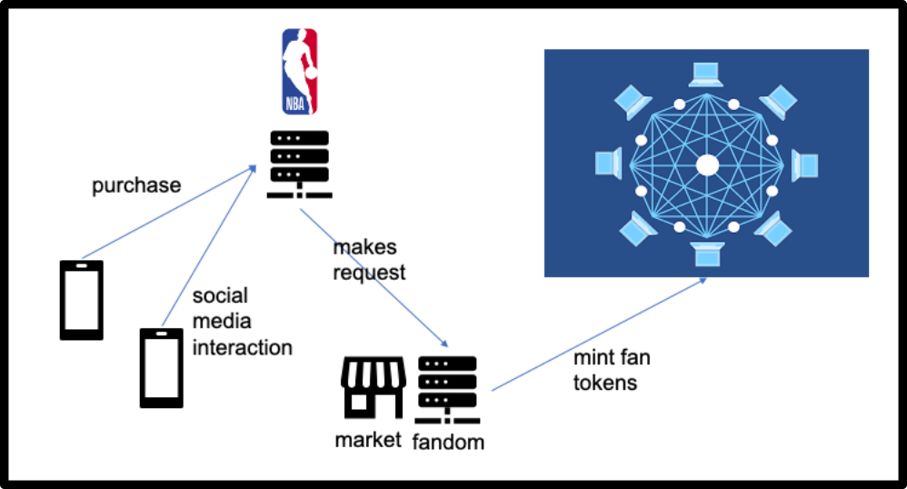

# Fandom_Cash: Building Your Brand One Token at a Time

  art credit: [@kevinclee26](https://github.com/kevinclee26)

---
## Executive Summary

FandomCash addresses numerous problems in the sports industry and the entertainment industry, benefitting a celebrity, organization, or entertainment group and the fan communities engaging with the industry. 

FandomCash identifies several challenges to deepening the engagement between fans and their teams. Solving these challenges include:
 - Expanding connections between fans globally;
 - Inviting fans to participate in teams' decision-making;
 - Offering experiences that involve new technology;

FandomCash uses Blockchain technology to deepen engagement between fans and their teams. The blockchain opens the door for automated, transparent and secure interactions between fans and the teams.

---
## What's Being Created

#### FandomCash is composed of 2 main user interfaces:

1. The fan will be able to earn FAN tokens by interacting with the team's social media end points. We will create an ERC-20 compliant token that will be minted by using a contract from the OpenZeppelin Solidity library. The FAN tokens can then be spent on the team's Marketplace in exchange for team paraphrenalia, voting on team decisions and season tickets.
2. In order to earn FAN tokens, a fan must first purchase a Fandom Super Pass NFT. This NFT, like others, can be sold and transferred while maintaining all the privileges that go with it. The blockchain will serve to document and validate each NFT's rightful owner (as well as show the history of ownership).

---
## Technologies

This application is written in Solidity with [Remix 0.22.2 IDE](https://remix-ide.readthedocs.io/en/latest/index.html)

Other dependencies:

 - [ERC20](https://github.com/OpenZeppelin/openzeppelin-contracts/blob/release-v2.5.0/contracts/token/ERC20/ERC20.sol) - *a standard for Fungible Tokens.*
 - [ERC20Detailed](https://github.com/OpenZeppelin/openzeppelin-contracts/blob/release-v2.5.0/contracts/token/ERC20/ERC20Detailed.sol) - *sets values for `name`, `symbol` and `decimals`.*
 - [ERC20Mintable](https://github.com/OpenZeppelin/openzeppelin-contracts/blob/release-v2.5.0/contracts/token/ERC20/ERC20Mintable.sol) - *Extension of {ERC20} that adds a set of accounts with the {MinterRole}, which have permission to mint (create) new tokens as they see fit.*
 - [Crowdsale](https://github.com/OpenZeppelin/openzeppelin-contracts/blob/release-v2.5.0/contracts/crowdsale/Crowdsale.sol) - *Crowdsale is a base contract for managing a token crowdsale, allowing investors to purchase tokens with ether.*
 - [MintedCrowdsale](https://github.com/OpenZeppelin/openzeppelin-contracts/blob/release-v2.5.0/contracts/crowdsale/emission/MintedCrowdsale.sol) - *Extension of Crowdsale contract whose tokens are minted in each purchase.*
 - [CappedCrowdsale](https://github.com/OpenZeppelin/openzeppelin-contracts/blob/release-v2.5.0/contracts/crowdsale/validation/CappedCrowdsale.sol) - *Crowdsale with a limit for total contributions.*
 - [TimedCrowdsale](https://github.com/OpenZeppelin/openzeppelin-contracts/blob/release-v2.5.0/contracts/crowdsale/validation/TimedCrowdsale.sol) - *Crowdsale accepting contributions only within a time frame.*
 - [RefundablePostDeliveryCrowdsale](https://github.com/OpenZeppelin/openzeppelin-contracts/blob/release-v2.5.0/contracts/crowdsale/distribution/RefundablePostDeliveryCrowdsale.sol) - *Extension of RefundableCrowdsale contract that only delivers the tokens once the crowdsale has closed and the goal met, preventing refunds to be issued to token holders.*
 - [SafeMath](https://github.com/OpenZeppelin/openzeppelin-contracts/blob/master/contracts/utils/math/SafeMath.sol) - *a library to help you check for overflows in case of addition, underflow in case of substraction as well as when performing multiplication and division.*
 - [ERC721](https://github.com/OpenZeppelin/openzeppelin-contracts/tree/release-v2.5.0/contracts/token/ERC721) - *a standard for Non-Fungible Tokens.*
 
The main application is written in Python 3.7 using Jupyter Lab v3.0.14

 - [Streamlit](https://streamlit.io/) - *an open source library that turns data scripts into shareable web apps in minutes.*
 - [Web3.py v5.17](https://web3py.readthedocs.io/en/stable/) - *a Python library for interacting with Ethereum.*
 - [Ganache](https://trufflesuite.com/ganache/) - *a program that allows you to quickly set up a local blockchain, which you can use to test and develop smart contracts.*
 - [python-dotenv](https://pypi.org/project/python-dotenv/) - *a Python library that reads key-value pairs from a .env file and can set them as environment variables.*
 - [Requests](https://docs.python-requests.org/en/latest/) - *an elegant and simple HTTP library for Python, built for human beings.*
 - [Pinata](https://docs.pinata.cloud/) - *a file pinning service that works with Interplanetary File System (IPFS)*
 - [IPFS](https://docs.ipfs.io/) - *a distributed system for storing and accessing files, websites, applications, and data.*

### Installation Guide

prior to running these libraries, install them from the command line:
 
  - streamlit: `pip install streamlit`
  - web3: `pip install web3`
  - python-dotenv: `pip install python-dotenv`
  - Requests: `python -m pip install requests`
 
---
## Usage

### NFT Minting Demo:

### Compile FandomCash contract

### Create MetaMask accounts with Ganache

### Use MetaMask to deploy Ganache

### Confirm the gas fee and check the new account balance

### Run streamlit.py

---
## Next Steps / Future Ideas

 - We will create a marketing plan:
    1. Target market
    2. Product line expansion
    3. Competition

- We will establish a User Interface:
    1. Allow users to navigate easily
    2. Provide informative feedback
    3. Design dialog to yield closure

- Expand on Voting and other privileges that go with being a Super Pass Fan!

---

## Contributors
John Felder - [@JohnFelder](https://github.com/JohnFelder)

Patten Williams - [@pwilli23](https://github.com/pwilli23)

Derek Hall - [@Hderek22](https://github.com/Hderek22)

Chancie Altham - [@caltham](https://github.com/caltham)

Geoff Tarleton - [@blandwhite](https://github.com/blandwhite)

adapted from Starter Code supplied by UNCC FinTech Online Bootcamp by Trilogy Educational Services, a 2U, Inc. brand.

---

## License

[MIT](LICENSE)
